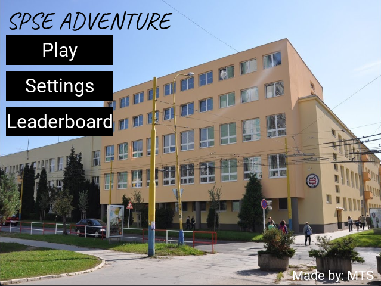

# <i style="color: lightgreen">**SPŠE ADVENTURE - REVENGEANCE**</i>
</img>

## <i style="color: lightgreen">**What's SPŠE ADVENTURES?**</i>

- ~~**100%**~~ <b style="color: #33CCFF">**94.69%**</b> 2D Replica of the real <i style="color: lightgreen">***SPŠE***</i> in Prešov

- Exciting <i style="color: #FFFF99">***storylines***</i> and quests

- Lots of <u style="color: red"><b style="color: red">**easter eggs**</b></u> to discover 

- All made in module <i style="color: lightgreen">**pygame**</i>

## <i style="color: lightgreen">**How to play our game?**</i>

1. <r>[Download](https://aeternix-forum.herokuapp.com/releases) </r> the game

2. Make sure you have `Pygame` installed
    > if not use >> `pip install pygame` in your python terminal or command prompt

3. Extract and run `main.py` file like so
    > `python` main.py 

4. Enjoy your own **SPŠE ADVENTURE**

## <i style="color: lightgreen">**About our game**</i>

- Try not getting caught breaking school rules or don't break them at all - <u style="color:#33CCFF"><i>your choice</i></u>

- If you're feeling tired, go relax in ***buffet Amper*** or buy yourself something pretty

- Discover multiple <b style="color: lightgreen">**good**</b> / <b style="color: red">bad</b> and <b style="color: #cc3399">secret</b> endings

> *Please keep in mind that all of the characters used in the game are only made up and any resemblance is just a coincidence.*

## <i style="color: lightgreen">**Gameplay**</i>
You are a student on SPŠE and your goal is to <i style="color: #cc3399">**discover**</i> as many:
- Rooms
- Endings
- Easter eggs

and <i style="color: lightgreen">**complete**</i> as many:
- Quests 
- Riddles

as you can throughout your playthrough while having a good time in ~~your favourite~~ school!  
> ***Careful, don't get lost!***

## <i style="color: lightgreen">**Endings waiting to be discovered**</i>

<i style="color: pink">**Something from good endings**</i>

- You get all the grades and can go home a few minutes earlier
- *And more to discover...*

<i style="color: teal">**Something from bad endings**</i>

- You get distracted waiting for your PE teacher and fall out of a window on accident 😱
- You get caught not wearing propper footwear at school and the cleaning lady gets mad
- *But wait... **there's more**...*

> **A pygame project by a Slovak team consisting of Tomáš Nosaľ, Samuel Pasierb and Marko Olejník**
